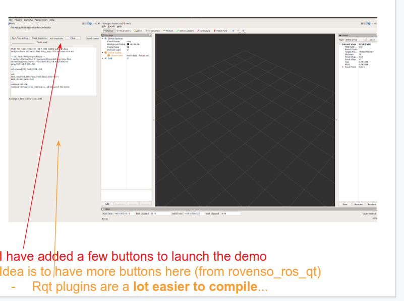

# A Template rqt plugin

A sample rqt plugin. Use this as a template to create your own rqt_plugins

Also keyboard events work. Please refer to the code to see how to get it running. 



## SIGNALS and SLOTS
It is easy to setup signals and slots. You can set the .connect() in the constructor.
You need to correctly set the names of the buttons in the Qt-designer. Using qt-docs
you can know the signals available for the datatype.


## How to run
```
cd catkin_ws
catkin_make

rqt --standalone manohar_rqt_mypkg

ALSO TRY
rqt --force-discover --standalone rovenso_rqt_outdoordemo
```


## Make your own
Use this as a template to make your own packages. Please follow these instructions to change the name and add your own settings. It is easiest to write the
gui with python. Although it is also possible with C++.

### Step-1: Choose a name for your package
Say you choose the name `foo-bar-plugin`. Note, I have named the package `manohar_rqt_mypkg`.

### Step-2: Edit CMakeLists.txt
You will have to change a) the project name, b) install path to `foo-bar-plugin`.

### Step-3: Edit package.xml
Change: a) package name and description


### Step-4: Edit plugin.xml
The gui is made up of your python package. You need to specify the module in `plugin.xml`
Most errors will originate due to improper settings in this file.

Change: a) class name, type. b) Description, icon, label (optional).

You will see this:
```
<class name="My Plugin" type="manohar_rqt_mypkg.my_module.MyPlugin" base_class_type="rqt_gui_py::Plugin">
```

```
My Plugin: The name as it should appear in rqt
type: The address of your gui element class.
    manohar_rqt_mypkg --> name of your package. Is under src/
    my_module --> file name of the file which contains your class
    MyPlugin --> name of your class.
```

### Step-5: Edit setup.py
Write the name of your package here inplace of `manohar_rqt_pkg`. 

### Step-6: Edit scripts/manohar_rqt_pkg.py
Rename this file to your package name. Also edit the contents to indicate your package. 


### Step-6: src/{my-pkg-name}/my_module.py
This is the main gui class. Most importantly you will see (in the constructor)
a .ui file being loaded. This .ui file can be found under `resource/MyPlugin2.ui`.
This can be created using the tool `QtDesigner`.

Here you will define the qt-SLOTs for each buttons etc. This is a
rosnode, so you can also define ros Publishers and Subscribers here.
Please see [this](http://wiki.ros.org/rqt/Tutorials/Writing%20a%20Python%20Plugin)
for details on how to define this class.

### Step-7: Custom .ui file

Use Qt Designer to create a GUI. Be sure to have it of the type QWidget.
You can have a look at the .ui file (an XML) to know the type. If it is QDialog for example, it will
not work with rqt.

## Reference
- [ROS rqt-plugin Tutorial](http://wiki.ros.org/rqt/Tutorials/Create%20your%20new%20rqt%20plugin)
